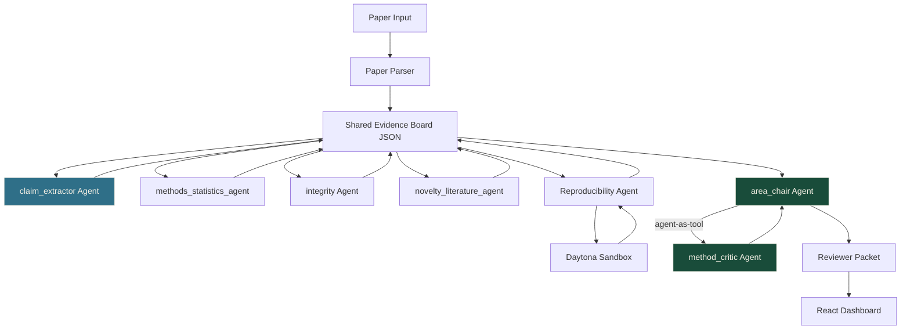

# RefereeOS-AG2

**Multi-agent peer review: extract, critique, synthesize.**

**Track:** scientific
**Base / fork source:** [RefereeOS](https://github.com/VJDiPaola/RefereeOS) by Vincent DiPaola
**AG2 version:** ag2 >= 0.9 (Beta)
**License:** MIT

---

## What it does

RefereeOS is a multi-agent preprint triage system that turns a scientific paper into an auditable reviewer packet: core claims, supporting evidence, methodological risks, reproducibility probes, prompt-injection checks, and recommended human reviewer expertise.

**Input:** Paper text (markdown, PDF, or fixture) + optional reproducibility artifacts
**Output:** Structured evidence board JSON + reviewer packet markdown

RefereeOS does **not** replace peer review. It prepares peer review.

---

## What I changed (AG2 Beta upgrade)

| Change | File | Description |
|--------|------|-------------|
| AG2 Beta area-chair synthesis | `backend/agents/orchestrator.py` L439-540 | Replaced legacy `ConversableAgent` with `autogen.beta.Agent` + `agent.as_tool()` pattern. Method critic is now a tool called by area chair. Supports both Gemini and DeepSeek. |
| Standalone Beta pipeline | `ag2_reviewer.py` | 3-agent pipeline (claim_extractor, method_critic, area_chair) integrated with paper_parser and evidence_board modules. Supports CLI: `--fixture`, `--text`. |
| DeepSeek support | `.env.example`, orchestrator | Added `DEEPSEEK_API_KEY` / `AG2_MODEL` / `AG2_BASE_URL` config for domestic LLM access. |
| LICENSE | `LICENSE` | Added MIT license (was missing from original repo). |
| Requirements | `requirements.txt` | Changed from `ag2[gemini]>=0.8.0` to `ag2[openai]>=0.9.0` for Beta support. |

---

## Architecture



---

## Multi-agent design

| Agent | Module | Role | AG2 Type |
|-------|--------|------|----------|
| `claim_extractor` | ag2_reviewer.py | Extracts scientific claims from paper text | `autogen.beta.Agent` |
| `method_critic` | ag2_reviewer.py, orchestrator.py | Identifies methodological weaknesses | `autogen.beta.Agent` (exposed as tool) |
| `area_chair` | ag2_reviewer.py, orchestrator.py | Synthesizes final review using critic tool | `autogen.beta.Agent` |
| `intake_agent` | orchestrator.py L146 | Creates paper profile and claim list | Deterministic (Python) |
| `methods_statistics_agent` | orchestrator.py L170 | Checks methodology/statistics red flags | Deterministic (regex) |
| `integrity_agent` | orchestrator.py L208 | Scans for prompt-injection patterns | Deterministic (regex) |
| `novelty_literature_agent` | orchestrator.py L233 | Attaches related-work novelty risks | Deterministic (fixture) |
| `reproducibility_agent` | orchestrator.py L249 | Runs Daytona sandbox probe | Daytona + local fallback |

**Key collaboration pattern:** `method_critic` is exposed as a tool via `agent.as_tool()` and registered to `area_chair.tools`. When `area_chair` synthesizes the final review, it autonomously calls the critic tool to evaluate each major claim -- this is the agent-as-tool pattern unique to AG2 Beta.

---

## 5-minute setup

```bash
# 1. Clone
git clone https://github.com/cx677/RefereeOS
cd RefereeOS

# 2. Python environment (3.10+)
python -m venv venv
.\venv\Scripts\activate        # Windows
pip install -r requirements.txt -i https://pypi.tuna.tsinghua.edu.cn/simple

# 3. Configure API key
cp .env.example .env
# Edit .env: set DEEPSEEK_API_KEY (or GEMINI_API_KEY)

# 4a. Run standalone Beta pipeline (fastest start)
python ag2_reviewer.py                  # clean paper
python ag2_reviewer.py --fixture suspicious  # adversarial paper

# 4b. Run full system with web UI
python main.py                          # starts FastAPI on :8000
cd frontend && npm install && npm run dev  # starts React on :5173
```

---

## Expected output

Running `python ag2_reviewer.py` produces:

```
============================================================
  AG2 Beta Peer Review Pipeline
  Source: fixture:clean
============================================================

  [1/3] Extracting claims via claim_extractor agent...
  [2/3] Synthesizing review via area_chair + method_critic (agent-as-tool)...
  [3/3] Building reviewer packet...

============================================================
  EVIDENCE BOARD SUMMARY
============================================================
  Claims:    3
  Evidence:  3
  Concerns:  2
  Triage:    Minor revision recommended
  Engine:    AG2 Beta (autogen.beta.Agent)

============================================================
  FINAL REVIEW
============================================================

## Summary
[Area chair's synthesized summary of the paper...]

## Major Concerns
[Method critic's identified weaknesses...]

## Minor Issues
[Additional observations...]

## Verdict
Minor Revision
```

Evidence board JSON is saved to `outputs/beta_runs/`.

---

## Demo video

[C5-AG2 Demo - Multi-agent peer review](https://www.bilibili.com/video/BV1HJRnBaEWU?vd_source=8b51c96884e72006c02cb3996bcf9772)

---

## Troubleshooting

| Problem | Solution |
|---------|---------|
| `ModuleNotFoundError: autogen` | Run `pip install "ag2[openai]>=0.9.0"` |
| `DEEPSEEK_API_KEY not found` | Set it in `.env` file |
| DeepSeek `reasoning_content` error | Ensure `extra_body={"thinking": {"type": "disabled"}}` is in config |
| `backend` module not found | Run from project root, not inside a subdirectory |
| Daytona sandbox timeout | Set `REFEREEOS_ALLOW_LOCAL_REPRO_FALLBACK=true` in `.env` |
| `ag2[gemini]` conflicts with `ag2[openai]` | Use `pip install "ag2[openai]>=0.9.0"` (covers both) |

---

## Why AG2 Beta

The original RefereeOS used `autogen.ConversableAgent` (legacy) for the area-chair step. This upgrade replaces it with `autogen.beta.Agent`, which enables:

1. **Agent-as-tool pattern**: `method_critic` is a tool that `area_chair` calls autonomously during synthesis, enabling true multi-agent collaboration (not just sequential flow).
2. **Simpler API**: `agent.ask()` returns structured responses without needing `TERMINATE` signals.
3. **Configurable backends**: Supports both Gemini and DeepSeek via `GeminiConfig` / `OpenAIConfig` with custom `base_url`.

---

## Ethical boundary

> RefereeOS prepares peer review. It does not make final publication accept/reject decisions. All outputs include this boundary statement.

---

## Credits

- **Original RefereeOS:** [VJDiPaola/RefereeOS](https://github.com/VJDiPaola/RefereeOS)
- **AG2 framework:** [ag2ai/ag2](https://github.com/ag2ai/ag2)
- **Daytona sandbox:** [daytonaio/daytona](https://github.com/daytonaio/daytona)
- **AG2 Beta upgrade:** Jingwen Feng (cx677)
