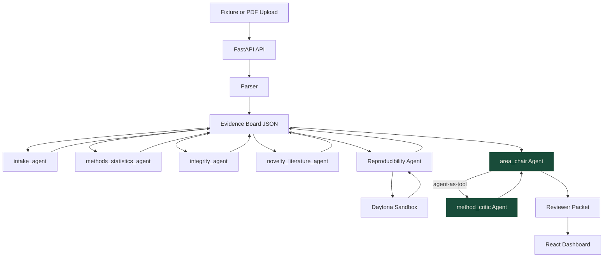

# RefereeOS Architecture

## After AG2 Beta Upgrade (cx677 fork)

## Key architectural changes from the original

**Original (VJDiPaola):**
- area_chair used `autogen.ConversableAgent` (legacy AG2) with Gemini only
- No agent-to-agent collaboration; single agent synthesis call
- "Sequential flow only, no orchestration" (judge feedback)

**Upgraded (cx677):**
- area_chair uses `autogen.beta.Agent` (AG2 Beta)
- method_critic is a separate `autogen.beta.Agent` exposed as a tool via `agent.as_tool()`
- area_chair autonomously calls method_critic during synthesis (agent-as-tool pattern)
- Supports both Gemini and DeepSeek via configurable `OpenAIConfig` / `GeminiConfig`
- Standalone `ag2_reviewer.py` provides a 3-agent Beta pipeline integrated with paper_parser and evidence_board

## Agent types

| Agent | Type | LLM | Pattern |
|-------|------|-----|---------|
| claim_extractor | `autogen.beta.Agent` | DeepSeek / Gemini | Direct `ask()` |
| method_critic | `autogen.beta.Agent` | DeepSeek / Gemini | Exposed as tool via `as_tool()` |
| area_chair | `autogen.beta.Agent` | DeepSeek / Gemini | Calls method_critic tool during synthesis |
| intake_agent | Deterministic Python | None | `_intake()` function |
| methods_statistics_agent | Deterministic Python | None | Regex-based checks |
| integrity_agent | Deterministic Python | None | `injection_scan.py` regex patterns |
| novelty_literature_agent | Deterministic Python | None | Related-work fixture lookup |
| reproducibility_agent | Daytona + local | OpenAI in sandbox | `daytona_runner.py` |

## Data flow

1. Paper text is parsed by `paper_parser.py` into structured dict (title, abstract, claims, methods, etc.)
2. An empty evidence board is created by `evidence_board.py`
3. Six deterministic agents populate the board with claims, evidence, concerns, and repro_checks
4. When `REFEREEOS_ENABLE_AG2_LLM=true`, the area_chair Beta agent synthesizes the full board into a reviewer packet, calling method_critic as a tool for methodology analysis
5. The final packet is stored in the evidence board and rendered by the React frontend

## Standalone pipeline

`ag2_reviewer.py` provides an independent 3-agent Beta pipeline that:
- Accepts paper text via CLI (`--fixture` or `--text`)
- Uses RefereeOS's `paper_parser` and `evidence_board` modules
- Produces a JSON evidence board and markdown review packet
- Saves output to `outputs/beta_runs/`
